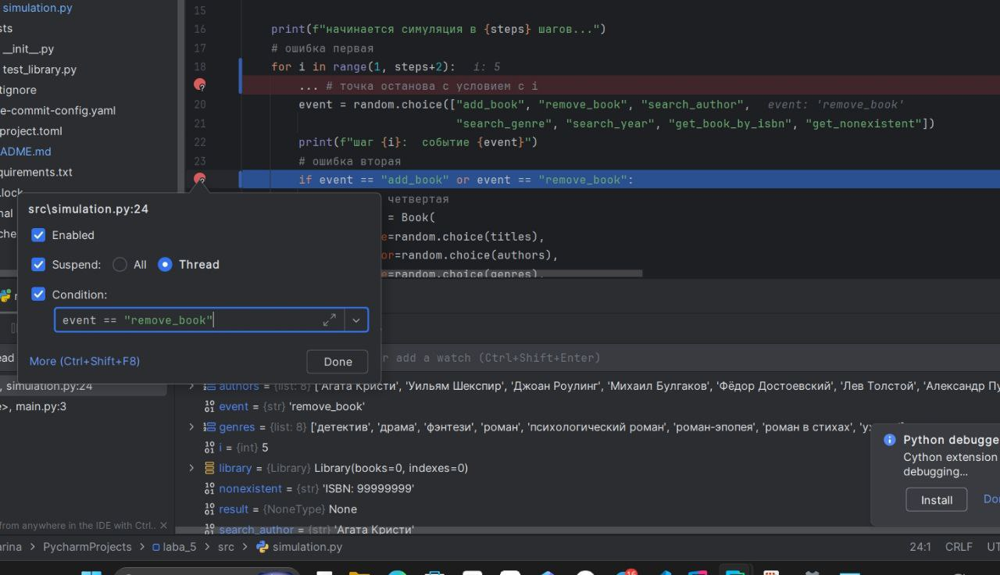
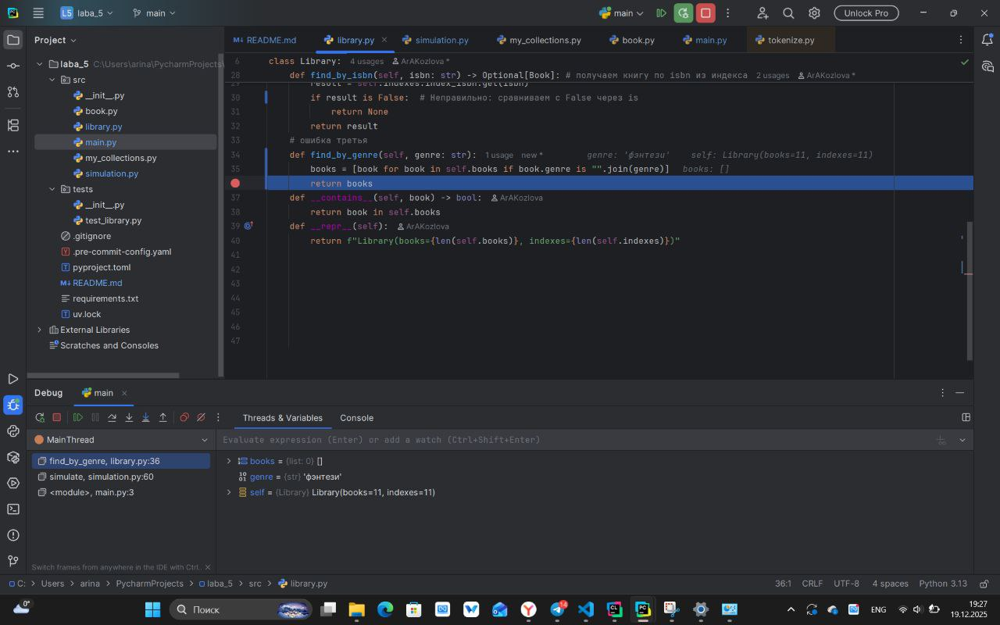
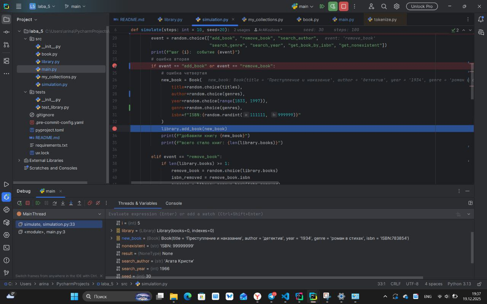
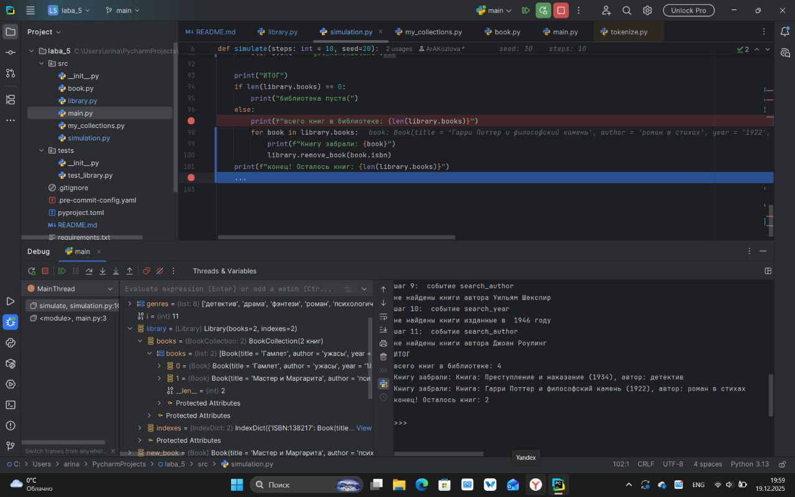

# Лабораторная работа №5

### Отладĸа ĸодовой базы проеĸта на Python с помощью средств отладĸи
### Ошибка 1 — ошибка границы цикла (off-by-one)
Место: simulation.py, строка 19

Симптом:
Цикл выполняется на 1 шаг больше, 
чем указано в параметре steps

Как воспроизвести:
Запустить симуляцию с steps=10. 
Будет выполнено 11 итераций

Отладка:
Установлен breakpoint на условие for.
В отладчике видно, что i доходит до значения 11.

Причина:
Неверно указан конец диапазона в range

Исправление:
- Заменено (for i in range(1, steps+2))
- На (for i in range(1, steps + 1)

Проверка:
Поведение симуляции соответствует ожидаемому.

Доказательства:

### Ошибка 2 — неверное логическое условие
Место: simulation.py, строка 24

Симптом:
Книги добавляются не только при условии add_book, но и при условии remove_book.

Как воспроизвести:
Запустить симуляцию. 
В некоторых шагах будет печататься "добавили книгу" и будет происходить добавление,
хотя событие не "add_book".

Отладка:
Breakpoint на if event == "add_book" or "remove_book". 
Видим, что книга при условии remove_book все равно добавляется в библиотеку

Причина:
Использовано неверное составное условие с or

Исправление:
- Заменено (if event == "add_book" or "remove_book":)
- На (if event == "add_book":)

Проверка:
Книги добавляются только при событии "add_book"

Доказательства: 

### Ошибка 3 —  сравнение через is вместо ==
Место: library.py, строка 34

Симптом:
При вызове find_by_genre даже при совпадении,
программа не считает их одинаковыми.

Как воспроизвести:
Запустить симуляцию и наблюдать за поиском по жанру.

Отладка:
Установить breakpoint на возвращаемом значении.

Причина:
сравнение is дает некорректный результат при сравнении.

Исправление:
- Заменено (books = [book for book in self.books if book.genre is "".join(genre)])
- На (return [book for book in self.books if book.genre == genre])

Проверка:
сравнение работает корректно

Доказательства: 

### Ошибка 4 — перепутанные аргументы или поля объекта
Место: simulation.py, строка 33

Симптом:
В поле автор мы выбираем из категории жанр книги.

Как воспроизвести:
При добавлении книги в поле автора записывается жанр и наоборот.

Отладка:
Breakpoint в конструкторе Book.

Причина:
Аргументы переданы неправильно.

Исправление:
- Заменено (new_book = Book(
    title=random.choice(titles),
    author=random.choice(genres),
    year=random.choice(range(1833, 1997)),
    genre=random.choice(genres),
    isbn=f"ISBN:{random.randint(111111, 999999)}"
))
- На (new_book = Book(
    title=random.choice(titles),
    author=random.choice(authors),
    year=random.choice(range(1833, 1997)),
    genre=random.choice(genres),
    isbn=f"ISBN:{random.randint(111111, 999999)}"
))

Проверка:
Теперь поля книги заполняются правильно.

Доказательства: 

### Ошибка 5 — изменение пользовательсĸой ĸоллеĸции во время итерации
Место: simulations.py, строка 97

Симптом:
От нашей программы ожидается удаление всех книг
из коллекции, но они все равно остаются

Как воспроизвести:
Запустить программу и смотреть на результат

Отладка:
Установить breakpoint на конце выполнения программы

Причина:
При действии программы пользовательская коллекция меняется во время итерации
и наша программа выполняется не так, как от нее требуется тк границы цикла
меняются при каждой итерации

Исправление:
- Заменено (def find_by_isbn(self, isbn: str) -> Optional[Book]:
    result =    else:
        print(f"всего книг в библиотеке: {len(library.books)}")
        for book in library.books:
            print(f"Книгу забрали: {book}")
            library.remove_book(book.isbn)
    print(f"конец! Осталось книг: {len(library.books)}"))
- На (else:
    print(f"всего книг в библиотеке: {len(library.books)}")
    books_to_remove = list(library.books)
    for book in books_to_remove:
        print(f"Книгу забрали: {book}")
        library.remove_book(book.isbn)
    print(f"конец! Осталось книг: {len(library.books)}"))

Проверка:
Теперь удаление работает корректно

Доказательства:

